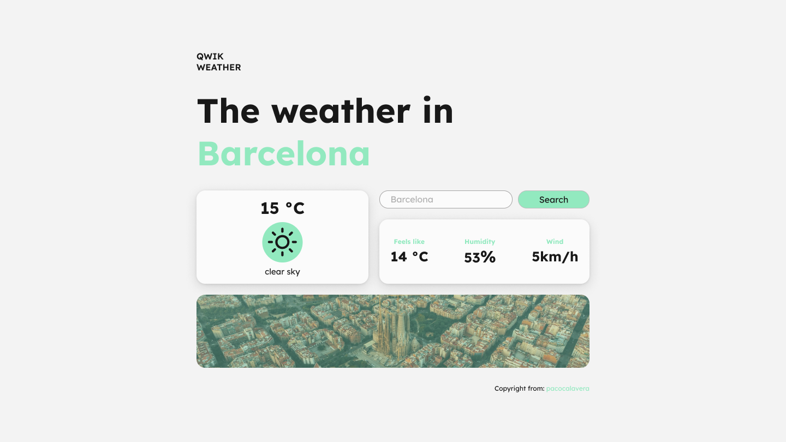

# Qwik City App ⚡️

- [Qwik Docs](https://qwik.builder.io/)

# 🌡️ Weather App

Aplicación del tiempo realizada como parte del curso avanzado de Qwik

## 💾 API e iconos

A continuación tenemos algo de información al respecto:

- 01: [API OpenWeather](https://openweathermap.org/api/)
- 02: [API unsplash para las imágenes](https://unsplash.com/developers/)
- 03: [Icons utilizados en el proyecto](https://erikflowers.github.io/weather-icons/)
- 04: [Link to original project by Manuel Sanchez](https://github.com/manuelsanchezweb/qwik-curso-avanzado/tree/main/projects/02-weather-app)

